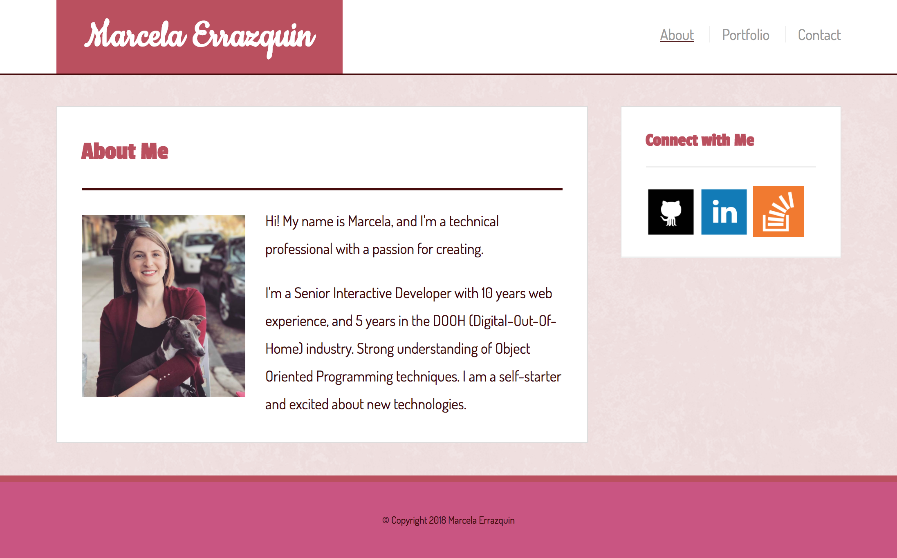
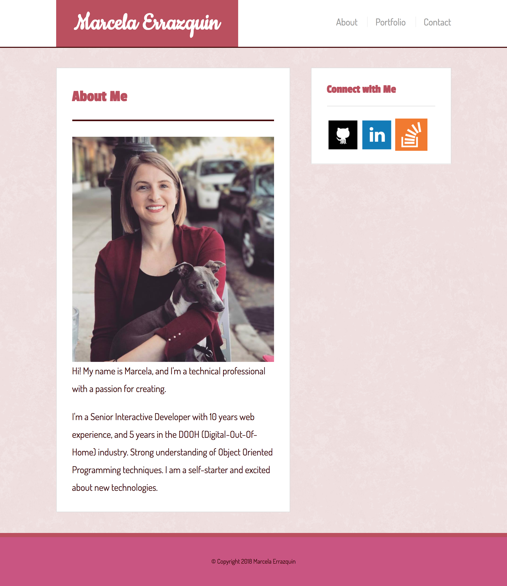
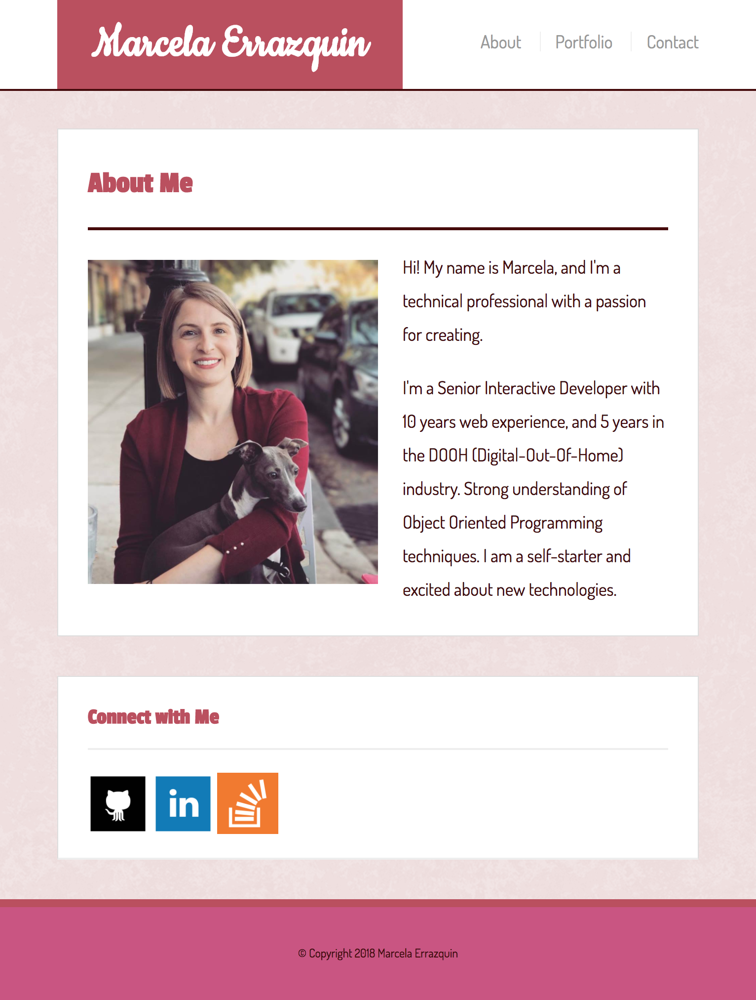
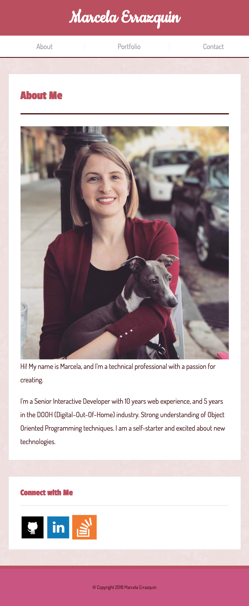

# Responsive-Portfolio

## Overview
For this project, I've added media queries to the [Basic Portfolio](http://github.com/merrazquin/Basic_Portfolio) assignment.

[Click here](http://merrazquin.github.io/Responsive-Portfolio) to launch this project in GitHub Pages

## Built with
* HTML
* CSS

## Screen sizes supported
* large - `> 980px wide`
* medium - `769px - 980px wide`
* small - `641px - 768px wide`
* x-small - `<= 640px wide`

## Screenshots

